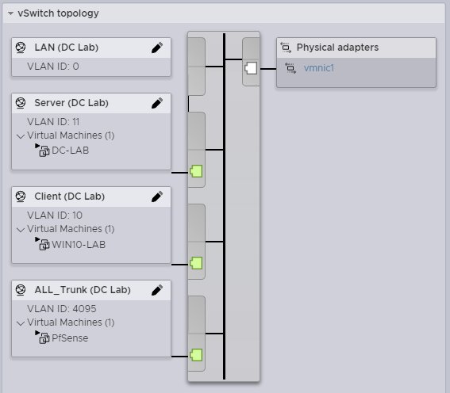
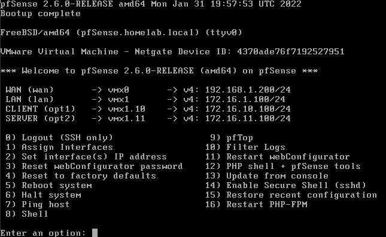
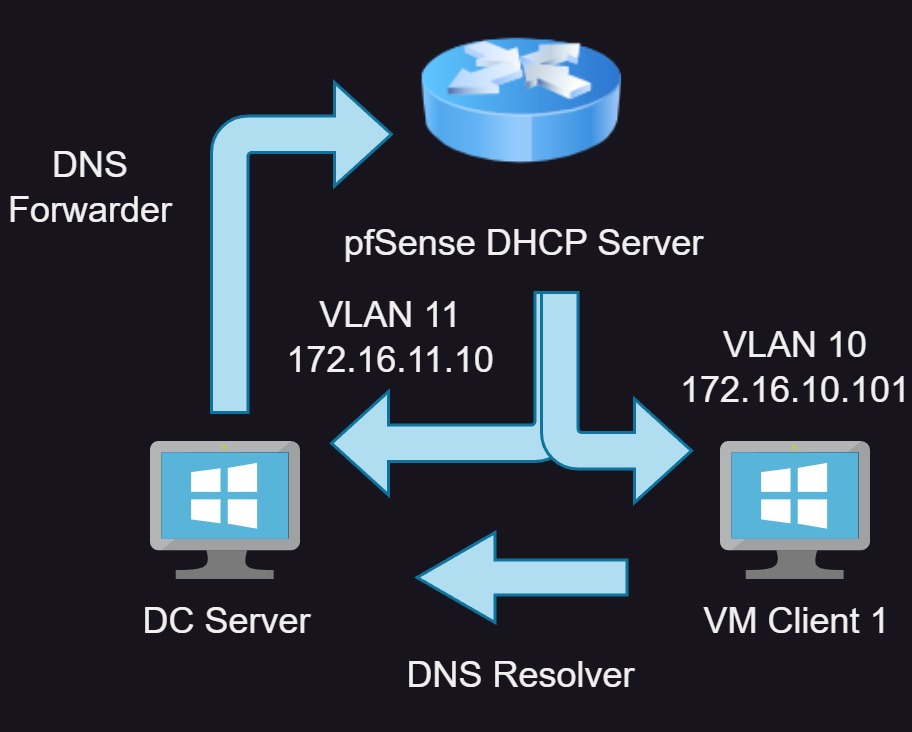

[Back](./)

## Current DC Lab Infrastructure with PFsense

## VMWare EXXi Requirements 
First we need two virtual switches for **Internal** and **External** communications. 
> Networking -> Virtual Switch -> Add standard virtual switch

Create the proper Port Groups for each of the VLAN network like below. Later they will be used to connect the VMs.

|Port Groups | VLAN ID |
|:----|:----|
| LAN (Internal) | 0 |
| Server (Internal) | 11 |
| Client (Internal) | 10 |
| ALL_Trunk (Internal) | 4096 |
| ISP (External) | 0 |

## PfSense Requirements
Create a Pfsense VM and add these networks 

Create Interface Assignments and enable DHCP on all of the Interfaces. Later we will make it also assign the DC's as the DNS resolver.

| Network | Address | DNS |
|:----|:----|:----|
| WAN | 192.168.1.200/24 | DHCP (Default) | 
| LAN | 172.16.1.100/24 | Router (Default) |
| CLIENT | 172.16.10.100/24 | 172.16.1.10 (AD-DC) |
| SERVER | 72.16. 11.100/24 | Router (Default) |

### Create Alliases

IP Address Alias For range of private IP address also known as **RFC1918**. This will make creating firewall rules a lot simpler to achieve network isolation. 

> Firewall -> Aliases -> IP Add -> Name: RFC1918
>  | IP | CIDR | 
>  |:----|:----|
>  |  192.168.0.0 |  16    | 
>  |  172.16.0.0   |   12  | 
>  |  10.0.0.0  |  8  | 

I want to have the most control over what is allowed so instead of using the allow all rule I disabled it and specifief spcific ports needed for basic internet browsing. Create an allise for ports used.

> Firewall -> Alliases -> Ports Add 
> | Port | Description | 
>  |:----|:----|
>  |  80 |  HTTP    | 
>  |  443   | HTTPS  | 
>  |  8080  | ALT/HTTPS  | 
>  |  53    | DNS |

## Windows Server Requirements
In this lab I'm just using the 2016 version of Windows Server. So as long as you have an ISO uploaded to your datastore, you can provision a new server to begin to configure. First we need a static Ip Address so use these settings on the adapter.

| Network Adapter | Address |
|:-----| ----:|
| IP Address | 172.16.11.10 |
| Subnet mask | 255.255.255.0 |
| Default gateway | 172.16.11.100 |
| DNS1 | 127.0.0.1 |

**Configure Windows 2016 Server Roles**
- Add Active Directory Domain Service
> Name: `homelab.local` 
- Add DNS Server 
> DNS Forwarder configured to send DNS request from the Pfsense Router. `Set-DnsServerForwarder -IPAddress "172.168.11.100"`

| Image| Description |
| ----------- | ----------- |
|  | So the way it work is The Router is in charge of handing out DHCP addresses and the Domain Controller is in charge of resolving IP Addresses for the **Client** interface. At the samee time using the pfSense router as a DNS forwarde| 

So the way it work is The Router is in charge of handing out DHCP addresses and the Domain Controller is in charge of resolving IP Addresses for the **Client** interface. 

## PfSense Firewall Rules

So the way it work is The Router is in charge of handing out DHCP addresses and the Domain Controller is in charge of resolving IP Addresses for the **Client** interface. 
#### Client VLAN Firewall Rules

| State| Protocol | Source | Port | Destination | Port | Description |
| ----- |:-----| ----|  ----|  ----|  ----|  ----|
| Allow | IPv4 ICMP | CLIENT net | * | * | * | Allow Ping |
| Allow | IPv4 TCP/UDP | CLIENT net | * | * | Browsing | Allow Internet Browsing |
| Allow | IPv4* | CLIENT net | * | 172.16.11.10 | * | Domain Controller Access |
| Block | IPv4* | CLIENT net | * | RFC1918 | * | Block RFC1918 |

#### Server VLAN Firewall Rules

| State| Protocol | Source | Port | Destination | Port | Description |
| ----- |:-----| ----|  ----|  ----|  ----|  ----|
| Allow | IPv4 ICMP | SERVER net | * | * | * | Allow Ping |
| Allow | IPv4 TCP/UDP | SERVER net | * | * | Browsing | Allow Internet Browsing |
| Allow | IPv4* | SERVER net | * | CLIENT net | * | Client Network Access |
| Block | IPv4* | SERVER net | * | RFC1918 | * | Block RFC1918 |

 

